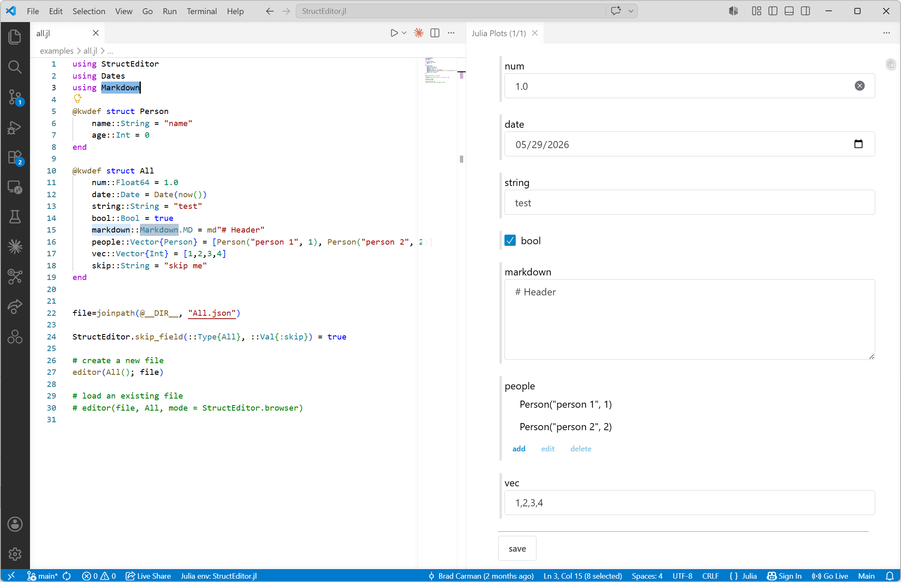

# StructEditor.jl

StructEditor.jl generates interactive web-based forms for editing Julia structs. It automatically maps struct fields to appropriate UI controls (using [ShoelaceWidgets.jl](https://bradcarman.github.io/ShoelaceWidgets.jl/dev/)), and saves/loads the result to a JSON file.

Here is an example of the form generated straight out of the box using StructEditor.jl



## Features

- Automatically generates form controls based on field types:
  - `Bool` → checkbox
  - `Number` / `String` → text input
  - `Date` → date input
  - `Markdown.MD` → multi-line textarea
  - `Vector` → tree view with per-item dialogs for nested structs
- Autoamitically builds control cards for child structs
- Loads and saves struct data as JSON
- Renders in VS Code (default) or a browser

## Installation

```julia
using Pkg
Pkg.add(url="https://github.com/bradcarman/StructEditor.jl")
```

## Usage

```julia
using StructEditor
using Dates
using Markdown

@kwdef struct Person
    name::String = "name"
    age::Int = 0
end

@kwdef struct All
    num::Float64 = 1.0
    date::Date = Date(now())
    string::String = "test"
    bool::Bool = true
    markdown::Markdown.MD = md"# Header"
    people::Vector{Person} = [Person("person 1", 1), Person("person 2", 2)]
end

file = joinpath(@__DIR__, "All.json")

# Edit a new value in VS Code
editor(All(); file)

# Load an existing JSON file and open in the browser
editor(file, All; mode = StructEditor.browser)
```

For more advanced examples: 
- how to handle `abstract` types, see "examples/pets.jl"
- how to handle manipulation of controls based on set values, see "examples/toggle.jl"
- how to handle composite field types, see "examples/special.jl"


## API

### `editor(value; file, mode, kwargs...)`

Opens an editor for `value` (a struct instance). Changes are saved to `file` when the **save** button is clicked.

- `file`: path to the JSON file (default: `"value.json"`), if empty the `save` button is not included
- `mode`: `StructEditor.vscode` (default) or `StructEditor.browser`

Additional keywords are passed to `StructEditor.make_form`...
- `class`: the CSS class to style the form (default: "centered", a built-in style)
- `container`: the function that each struct field control is wrapped with (default: `cell` is built-in, a styled `DOM.div`)
- `buttons`: add additional buttons along side `save` thru this keyword (default: empty array `[]`)

### `editor(file, T; mode, kwargs...)`

Loads a struct of type `T` from a `file` path and opens an editor for it.

### `StructEditor.make_control!(value::Observable, ::Type{T}, sname::Symbol)`

By defining `make_control!` for your type `T`, customization is possible.  See "examples/pets.jl" for an example of how this can be implemented.


